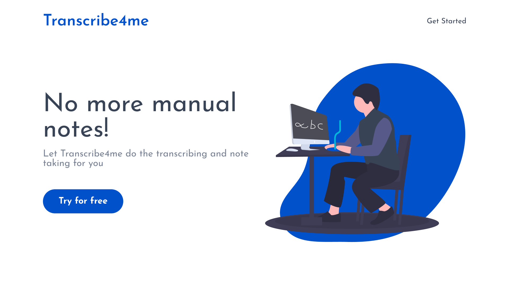

# Transcribe4me

Simple transcription service using python, django, react, celery and redis

## Setup
Install redis [here](https://redis.io/docs/getting-started/installation/)

Install requirements:
`pip install -r requirements.txt`

run `python manage.py runserver`

Run the following in separate a console/terminal

`celery -A transcriber worker --pool=solo -l info`

## Screenshots

